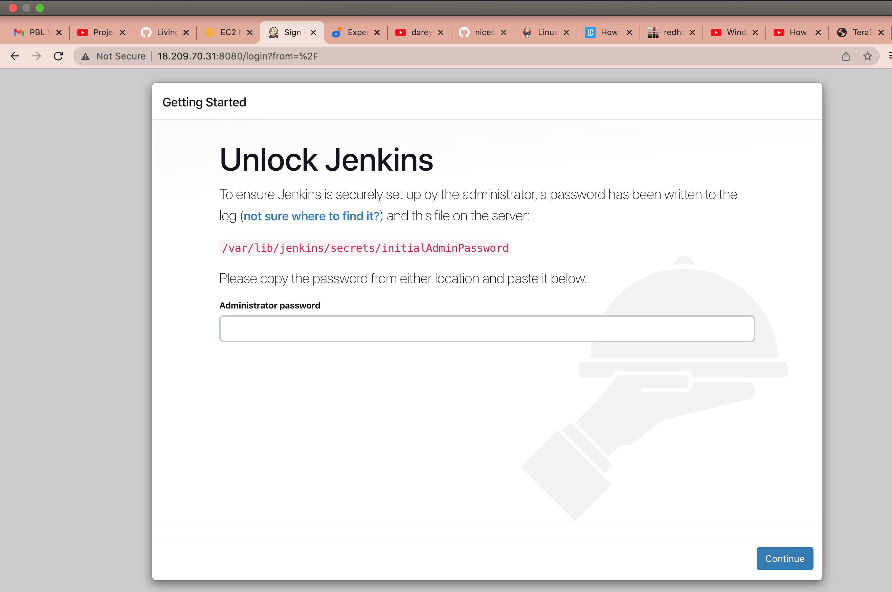
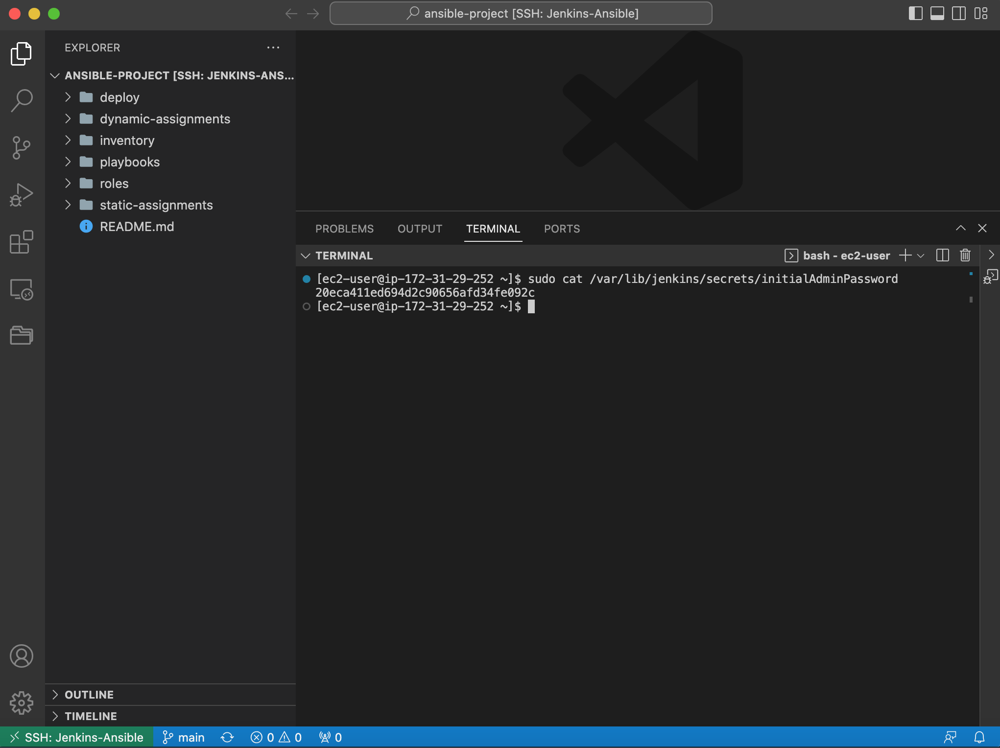
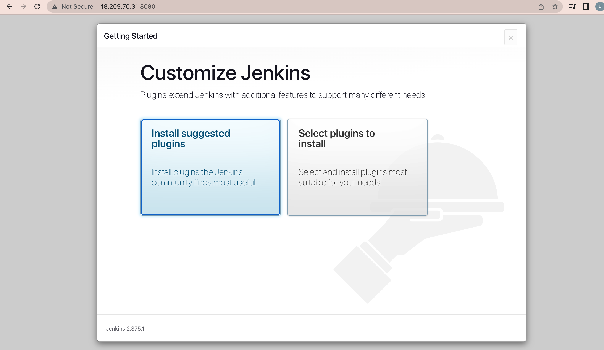
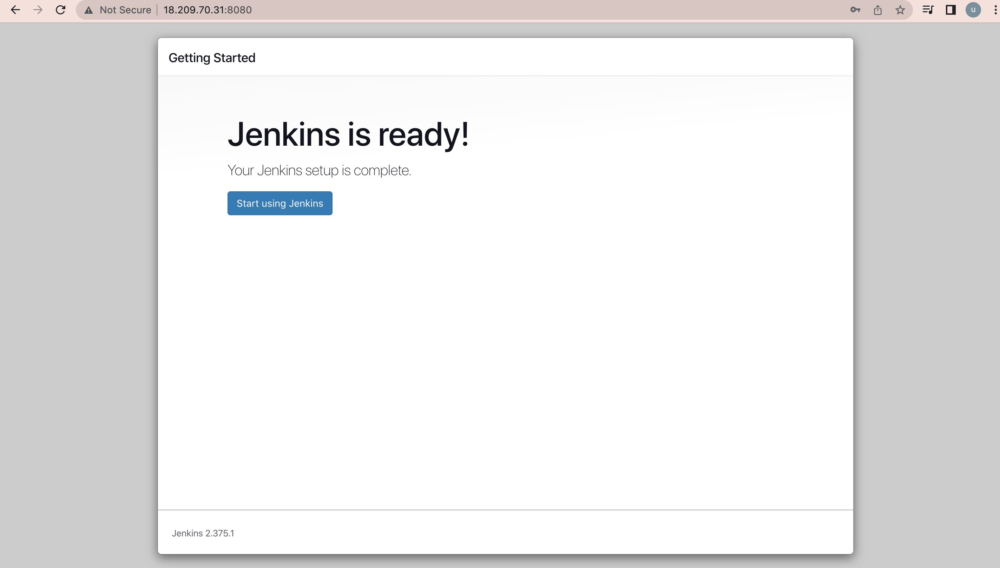

## EXPERIENCE CONTINUOUS INTEGRATION WITH JENKINS | ANSIBLE | ARTIFACTORY | SONARQUBE | PHP
==================================================


## **Project Description:**


In this project, I will be setting up a CI/CD Pipeline for a PHP based application. The overall CI/CD process looks like the architecture above.

This project is architected in two major repositories with each repository containing its own CI/CD pipeline written in a Jenkinsfile

* ansible-config-mgt REPO: this repository contains JenkinsFile which is responsible for setting up and configuring infrastructure required to carry out processes required for our application to run. It does this through the use of ansible roles. This repo is infrastructure specific
  
* PHP-todo REPO : this repository contains jenkinsfile which is focused on processes which are application build specific such as building, linting, static code analysis, push to artifact repository etc.


## **Pre-requisites**

Will be making use of AWS virtual machines for this and will require 6 servers for the project which includes: Nginx Server: This would act as the reverse proxy server to our site and tool.

**Jenkins server:** To be used to implement your CI/CD workflows or pipelines. Select a t2.medium at least, Ubuntu 20.04 and Security group should be open to port 8080

**SonarQube server:** To be used for Code quality analysis. Select a t2.medium at least, Ubuntu 20.04 and Security group should be open to port 9000

**Artifactory server:** To be used as the binary repository where the outcome of your build process is stored. Select a t2.medium at least and Security group should be open to port 8081

**Database server:** To server as the databse server for the Todo application

**Todo webserver:** To host the Todo web application.


Ansible Inventory should look like this

```
├── ci
├── dev
├── pentest
├── pre-prod
├── prod
├── sit
└── uat
```

ci inventory file

```
[jenkins]
<Jenkins-Private-IP-Address>

[nginx]
<Nginx-Private-IP-Address>

[sonarqube]
<SonarQube-Private-IP-Address>

[artifact_repository]
<Artifact_repository-Private-IP-Address>
```

dev Inventory file

```
[tooling]
<Tooling-Web-Server-Private-IP-Address>

[todo]
<Todo-Web-Server-Private-IP-Address>

[nginx]
<Nginx-Private-IP-Address>

[db:vars]
ansible_user=ec2-user
ansible_python_interpreter=/usr/bin/python

[db]
<DB-Server-Private-IP-Address>
```

pentest inventory file

```
[pentest:children]
pentest-todo
pentest-tooling

[pentest-todo]
<Pentest-for-Todo-Private-IP-Address>

[pentest-tooling]
<Pentest-for-Tooling-Private-IP-Address>
```


## **ANSIBLE ROLES FOR CI ENVIRONMENT**

Now we go ahead and Add two more roles to ansible:

1. SonarQube (Scroll down to the Sonarqube section to see instructions on how to set up and configure SonarQube manually)

Why do we need SonarQube?
SonarQube is an open-source platform developed by SonarSource for continuous inspection of code quality, it is used to perform automatic reviews with static analysis of code to detect bugs, code smells, and security vulnerabilities.

2. Artifactory

Artifactory is a product by JFrog that serves as a binary repository manager. The binary repository is a natural extension to the source code repository, in that the outcome of your build process is stored. It can be used for certain other automation, but we will it strictly to manage our build artifacts.

Configuring Ansible For Jenkins Deployment

In previous projects, you have been launching Ansible commands manually from a CLI. Now, with Jenkins, we will start running Ansible from Jenkins UI.

To do this,

1. Navigate to Jenkins URL

2. Install & Open Blue Ocean Jenkins Plugin

3. Create a new pipeline










4. Select Github


5. Connect Jenkins with GitHub


6. Login to GitHub & Generate an Access Token

7. Copy Access Token


8. Paste the token and connect

9.  Create a new Pipeline


At this point you may not have a Jenkinsfile in the Ansible repository, so Blue Ocean will attempt to give you some guidance to create one. But we do not need that. We will rather create one ourselves. So, click on Administration to exit the Blue Ocean console.

### **Let us create our Jenkinsfile**

Inside the Ansible project, create a new directory `deploy` and start a new file `Jenkinsfile` inside the directory.


Add the code snippet below to start building the `Jenkinsfile` gradually. This pipeline currently has just one stage called Build and the only thing we are doing is using the `shell script` module to echo `Building Stage`

```
pipeline {
    agent any

  stages {
    stage('Build') {
      steps {
        script {
          sh 'echo "Building Stage"'
        }
      }
    }
    }
}
```

Now go back into the Ansible pipeline in Jenkins, and select configure


Back to the pipeline again, this time click "Build now"


This will trigger a build and you will be able to see the effect of our basic `Jenkinsfile` configuration by going through the console output of the build.

To really appreciate and feel the difference of Cloud Blue UI, it is recommended to try triggering the build again from Blue Ocean interface.

1. Click on Blue Ocean

2. Select your project

3. Click on the play button against the branch


Let us see this in action.

1. Create a new git branch and name it `feature/jenkinspipeline-stages`

2. Currently we only have the `Build` stage. Let us add another stage called `Test`. Paste the code snippet below and push the new changes to GitHub.

```
   pipeline {
    agent any

  stages {
    stage('Build') {
      steps {
        script {
          sh 'echo "Building Stage"'
        }
      }
    }

    stage('Test') {
      steps {
        script {
          sh 'echo "Testing Stage"'
        }
      }
    }
    }
}
```

3. To make your new branch show up in Jenkins, we need to tell Jenkins to scan the repository.

4. Navigate to the Ansible project and click on "Scan repository now"

5. Refresh the page and both branches will start building automatically. You can go into Blue Ocean and see both branches there too.

6. In Blue Ocean, you can now see how the Jenkinsfile has caused a new step in the pipeline launch build for the new branch


## **RUNNING ANSIBLE PLAYBOOK FROM JENKINS**


Now that you have a broad overview of a typical Jenkins pipeline. Let us get the actual Ansible deployment to work by:

For instructions on installations of the dependencies use the link below:

[here](https://github.com/Tonybesto/ansible-config/blob/main/README.md)

1. Installing Ansible on Jenkins


2. Installing Ansible plugin in Jenkins UI


3. Creating Jenkinsfile from scratch. (Delete all you currently have in there and start all over to get Ansible to run successfully)

```
pipeline {
  agent any

  environment {
      ANSIBLE_CONFIG="${WORKSPACE}/deploy/ansible.cfg"
    }

  parameters {
      string(name: 'inventory', defaultValue: 'dev',  description: 'This is the inventory file for the environment to deploy configuration')
    }

  stages{
      stage("Initial cleanup") {
          steps {
            dir("${WORKSPACE}") {
              deleteDir()
            }
          }
        }

      stage('Checkout SCM') {
         steps{
            git branch: 'main', url: 'https://github.com/Tonybesto/ansible-config.git'
         }
       }

      stage('Prepare Ansible For Execution') {
        steps {
          sh 'echo ${WORKSPACE}' 
          sh 'sed -i "3 a roles_path=${WORKSPACE}/roles" ${WORKSPACE}/deploy/ansible.cfg'  
        }
     }

      stage('Run Ansible playbook') {
        steps {
           ansiblePlaybook become: true, colorized: true, credentialsId: 'private-key', disableHostKeyChecking: true, installation: 'ansible', inventory: 'inventory/${inventory}', playbook: 'playbooks/site.yml'
         }
      }

      stage('Clean Workspace after build'){
        steps{
          cleanWs(cleanWhenAborted: true, cleanWhenFailure: true, cleanWhenNotBuilt: true, cleanWhenUnstable: true, deleteDirs: true)
        }
      }
   }

}
```

Some possible errors to watch out for:

* Ensure that the git module in Jenkinsfile is checking out SCM to main branch instead of master (GitHub has discontinued the use of Master)

* Jenkins needs to export the ANSIBLE_CONFIG environment variable. You can put the .ansible.cfg file alongside Jenkinsfile in the deploy directory. This way, anyone can easily identify that everything in there relates to deployment. Then, using the Pipeline Syntax tool in Ansible, generate the syntax to create environment variables to set. Enter this into the ancible.cfg file

```
[defaults]
roles_path= /home/ec2-user/ansible-config/roles
timeout = 160
callback_whitelist = profile_tasks
log_path=~/ansible.log
host_key_checking = False
gathering = smart
ansible_python_interpreter=/usr/bin/python3
allow_world_readable_tmpfiles=true


[ssh_connection]
ssh_args = -o ControlMaster=auto -o ControlPersist=30m -o ControlPath=/tmp/ansible-ssh-%h-%p-%r -o ServerAliveInterval=60 -o ServerAliveCountMax=60 -o ForwardAgent=yes
```

* Remember that ansible.cfg must be exported to environment variable so that Ansible knows where to find Roles. But because you will possibly run Jenkins from different git branches, the location of Ansible roles will change. Therefore, you must handle this dynamically. You can use Linux Stream Editor sed to update the section roles_path each time there is an execution. You may not have this issue if you run only from the main branch.

* If you push new changes to Git so that Jenkins failure can be fixed. You might observe that your change may sometimes have no effect. Even though your change is the actual fix required. This can be because Jenkins did not download the latest code from GitHub. Ensure that you start the Jenkinsfile with a clean up step to always delete the previous workspace before running a new one. Sometimes you might need to login to the Jenkins Linux server to verify the files in the workspace to confirm that what you are actually expecting is there. Otherwise, you can spend hours trying to figure out why Jenkins is still failing, when you have pushed up possible changes to fix the error.

* Another possible reason for Jenkins failure sometimes, is because you have indicated in the Jenkinsfile to check out the main git branch, and you are running a pipeline from another branch. So, always verify by logging onto the Jenkins box to check the workspace, and run git branch command to confirm that the branch you are expecting is there.

* Parameterizing Jenkinsfile For Ansible Deployment. So far we have been deploying to dev environment, what if we need to deploy to other environments? We will use parameterization so that at the point of execution, the appropriate values are applied. To parameterize Jenkinsfile For Ansible Deployment, Update CI inventory with new servers.

```
[tooling]
<SIT-Tooling-Web-Server-Private-IP-Address>

[todo]
<SIT-Todo-Web-Server-Private-IP-Address>

[nginx]
<SIT-Nginx-Private-IP-Address>

[db:vars]
ansible_user=ec2-user
ansible_python_interpreter=/usr/bin/python

[db]
<SIT-DB-Server-Private-IP-Address>
```


2. Update Jenkinsfile to introduce parameterization. Below is just one parameter. It has a default value in case if no value is specified at execution. It also has a description so that everyone is aware of its purpose.

```
pipeline {
    agent any

    parameters {
      string(name: 'inventory', defaultValue: 'dev',  description: 'This is the inventory file for the environment to deploy configuration')
    }
```

3. In the Ansible execution section of the Jenkinsfile, remove the hardcoded inventory/dev and replace with ${inventory}


## **Note: Ensure that Ansible runs against the Dev environment successfully.**


## **CI/CD PIPELINE FOR TODO APPLICATION**


We already have tooling website as a part of deployment through Ansible. Here we will introduce another PHP application to add to the list of software products we are managing in our infrastructure. The good thing with this particular application is that it has unit tests, and it is an ideal application to show an end-to-end CI/CD pipeline for a particular application.


* Our goal here is to deploy the application onto servers directly from Artifactory rather than from git. If you have not updated Ansible with an Artifactory role, simply use this guide to create an Ansible role for Artifactory (ignore the Nginx part). 


## Phase 1 – Prepare Jenkins
============================


1. Fork the repository below into your GitHub account

`https://github.com/darey-devops/php-todo.git`


2. On you Jenkins server, install PHP, its dependencies and Composer tool (Feel free to do this manually at first, then update your Ansible accordingly later)

```
yum module reset php -y
yum module enable php:remi-7.4 -y
yum install -y php php-common php-mbstring php-opcache php-intl php-xml php-gd php-curl php-mysqlnd php-fpm php-json
systemctl start php-fpm
systemctl enable php-fpm
```

sudo apt install -y zip libapache2-mod-php phploc php-{xml,bcmath,bz2,intl,gd,mbstring,mysql,zip}


3. Install Jenkins plugins

* Plot plugin

* Artifactory plugin

4. Spin up another server that will host the jfrog artifactory 


We will use plot plugin to display tests reports, and code coverage information.
The Artifactory plugin will be used to easily upload code artifacts into an Artifactory server.

5. In Jenkins UI configure Artifactory


## **Phase 2 – Integrate Artifactory repository with Jenkins**


1. Create a dummy Jenkinsfile in the repository
   
2. Using Blue Ocean, create a multibranch Jenkins pipeline
   
3. On the database server, create database and user

Install mysql client: `sudo apt install mysql -y`

4. Login into the DB-server(mysql server) and set the the bind address to 0.0.0.0: sudo vi /etc/mysql/mysql.conf.d/mysqld.cnf

5. Create database and user. NOTE: The task of setting the database is done by the MySQL ansible role

```
Create database homestead;
CREATE USER 'homestead'@'%' IDENTIFIED BY 'sePret^i';
GRANT ALL PRIVILEGES ON * . * TO 'homestead'@'%';
```


1. Update the database connectivity requirements in the file .env.sample


2. Update Jenkinsfile with proper pipeline configuration

```
pipeline {
    agent any

  stages {

     stage("Initial cleanup") {
          steps {
            dir("${WORKSPACE}") {
              deleteDir()
            }
          }
        }

    stage('Checkout SCM') {
      steps {
            git branch: 'main', url: 'https://github.com/darey-devops/php-todo.git'
      }
    }

    stage('Prepare Dependencies') {
      steps {
             sh 'mv .env.sample .env'
             sh 'composer install'
             sh 'php artisan migrate'
             sh 'php artisan db:seed'
             sh 'php artisan key:generate'
      }
    }
  }
}
```
**When running we get an error. This is due to the fact that the Jenkins Server being the client server cant communicate with the DB server.**


3. We need to install mysql client on the Jenkins server and configure it.


The DB migration job passes after setting up the MYSQL client on the Jenkins server


4. Bundle the application code into an artifact (archived package) and upload to Artifactory


`Install Zip: Sudo apt install zip -y`


```
stage ('Package Artifact') {
    steps {
            sh 'zip -qr php-todo.zip ${WORKSPACE}/*'
     }
    }
```    
5. Publish the resulted artifact into Artifactory making sure ti specify the target as the name of the artifactory repository you created earlier

```
stage ('Upload Artifact to Artifactory') {
          steps {
            script { 
                 def server = Artifactory.server 'artifactory-server'                 
                 def uploadSpec = """{
                    "files": [
                      {
                       "pattern": "php-todo.zip",
                       "target": "PBL/php-todo",
                       "props": "type=zip;status=ready"

                       }
                    ]
                 }""" 

                 server.upload spec: uploadSpec
               }
            }

        }
```


Deploy the application to the dev environment by launching Ansible pipeline. Ensure you update your inventory/dev with the Private IP of your TODO-server and your site.yml file is updated with todo play.

```
stage ('Deploy to Dev Environment') {
    steps {
    build job: 'ansible-project/main', parameters: [[$class: 'StringParameterValue', name: 'env', value: 'dev']], propagate: false, wait: true
    }
  }
```


## SONARQUBE INSTALLATION

SONARQUBE INSTALLATION
SonarQube is a tool that can be used to create quality gates for software projects, and the ultimate goal is to be able to ship only quality software code.

Despite that DevOps CI/CD pipeline helps with fast software delivery, it is of the same importance to ensure the quality of such delivery. Hence, we will need SonarQube to set up Quality gates. In this project we will use predefined Quality Gates (also known as The Sonar Way). Software testers and developers would normally work with project leads and architects to create custom quality gates.

Setting Up SonarQube
On the Ansible config management pipeline, execute the ansible playbook script to install sonarqube via a preconfigured sonarqube ansible role.


When the pipeline is complete, access sonarqube from the browser using the <sonarqube_server_url>:9000/sonar


## CONFIGURE SONARQUBE AND JENKINS FOR QUALITY GATE


* Install SonarQube Scanner plugin


* Navigate to configure system in Jenkins. Add SonarQube server: Manage Jenkins > Configure System


* To generate authentication token in SonarQube to to: User > My Account > Security > Generate Tokens


* Setup SonarQube scanner from Jenkins – Global Tool Configuration. Go to: Manage Jenkins > Global Tool Configuration

* Update Jenkins Pipeline to include SonarQube scanning and Quality Gate. Making sure to place it before the "package artifact stage" Below is the snippet for a Quality Gate stage in Jenkinsfile.

```
stage('SonarQube Quality Gate') {
    environment {
        scannerHome = tool 'SonarQubeScanner'
    }
    steps {
        withSonarQubeEnv('sonarqube') {
            sh "${scannerHome}/bin/sonar-scanner"
        }

    }
}
```

## NOTE: The above step will fail because we have not updated sonar-scanner.properties.


* Configure sonar-scanner.properties – From the step above, Jenkins will install the scanner tool on the Linux server. You will need to go into the tools directory on the server to configure the properties file in which SonarQube will require to function during pipeline execution. cd /var/lib/jenkins/tools/hudson.plugins.sonar.SonarRunnerInstallation/SonarQubeScanner/conf/.
  
* Open sonar-scanner.properties file: sudo vi sonar-scanner.properties
* 
* Add configuration related to php-todo project

```
sonar.host.url=http://<SonarQube-Server-IP-address>:9000
sonar.projectKey=php-todo
#----- Default source code encoding
sonar.sourceEncoding=UTF-8
sonar.php.exclusions=**/vendor/**
sonar.php.coverage.reportPaths=build/logs/clover.xml
sonar.php.tests.reportPath=build/logs/junit.xml 
```


## End-to-End Pipeline Overview

Conditionally deploy to higher environments In the real world, developers will work on feature branch in a repository (e.g., GitHub or GitLab). There are other branches that will be used differently to control how software releases are done. You will see such branches as:

Develop Master or Main (The * is a place holder for a version number, Jira Ticket name or some description. It can be something like Release-1.0.0) Feature/* Release/* Hotfix/* etc.

There is a very wide discussion around release strategy, and git branching strategies which in recent years are considered under what is known as GitFlow (Have a read and keep as a bookmark – it is a possible candidate for an interview discussion, so take it seriously!)

Assuming a basic gitflow implementation restricts only the develop branch to deploy code to Integration environment like sit.

Let us update our Jenkinsfile to implement this:

First, we will include a When condition to run Quality Gate whenever the running branch is either develop, hotfix, release, main, or master

```
stage('SonarQube Quality Gate') {
      when { branch pattern: "^develop*|^hotfix*|^release*|^main*", comparator: "REGEXP"}
        environment {
            scannerHome = tool 'SonarQubeScanner'
        }
        steps {
            withSonarQubeEnv('sonarqube') {
                sh "${scannerHome}/bin/sonar-scanner -Dproject.settings=sonar-project.properties"
            }
            timeout(time: 1, unit: 'MINUTES') {
                waitForQualityGate abortPipeline: true
            }
        }
    }
```


